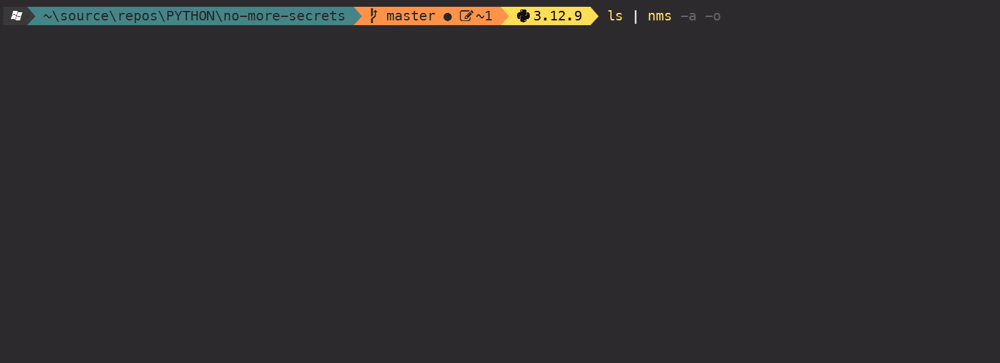
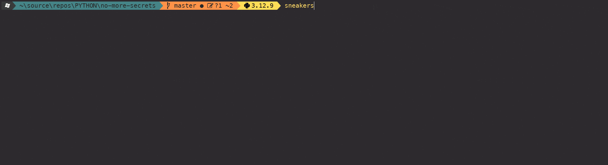

# No More Secrets - Python Implementation

A Python recreation of the famous data decryption effect from the 1992 hacker movie "Sneakers". This implementation provides the same functionality as the original C version created by [bartobri](https://github.com/bartobri/no-more-secrets) but with the convenience and cross-platform compatibility of Python.


## Features

- **Pipe Support**: Works with piped data from other commands
- **Interactive Mode**: Can accept direct text input
- **Color Options**: Multiple foreground colors for revealed text including custom hex colors
- **Auto-decrypt**: Optional automatic decryption without keypress
- **Space Masking**: Option to mask blank spaces
- **UTF-8 Support**: Handles Unicode characters properly
- **Color Preservation**: Can preserve original terminal colors from command output
- **Movie Recreation**: Includes `sneakers` command for exact movie scene

## Demos
<details>
<summary>Hello, World!</summary>


</details>

<details>
<summary>LS --color=awlays</summary>


</details>

<details>
<summary>tree</summary>


</details>

<details>
<summary>Sneakers</summary>


</details>

## Installation

### Using Poetry (Recommended)

```bash
# Clone the repository
git clone https://github.com/ondrovic/no-more-secrets-python.git
cd no-more-secrets-python

# Install with Poetry
poetry install

# Install with development dependencies
poetry install --with dev

# Install with all dependency groups
poetry install --with dev,docs,test

# Activate the virtual environment
poetry shell
```

### Using pip

```bash
# Clone and install in development mode
git clone https://github.com/ondrovic/no-more-secrets-python.git
cd no-more-secrets-python
pip install -e .

# Or install with development dependencies
pip install -e ".[dev]"
```

### From PyPI (when published)

```bash
pip install no-more-secrets
```

## Usage

### Basic Examples

```bash
# Pipe text to nms
echo "Hello World" | nms

# Pipe file contents
cat myfile.txt | nms

# Direct text input
nms "Secret message"

# Interactive mode (prompts for input)
nms
```

### Command Line Options

```bash
# Auto-decrypt (no keypress required)
echo "Hello" | nms -a

# Mask space characters
echo "Hello World" | nms -s

# Set foreground color
echo "Hello" | nms -f green

# Custom hex color
echo "Hello" | nms -x FF6600

# Preserve original colors
ls --color=always | nms -a -o

# Combine options
cat file.txt | nms -a -f red -s
```

### Available Colors

- `white`, `yellow`, `black`, `magenta`, `blue` (default), `green`, `red`, `cyan`
- Custom hex colors: Use `-x RRGGBB` (e.g., `-x FF0000` for red)

### Movie Scene Recreation

```bash
# Recreate the exact Sneakers movie scene
sneakers
```

## Command Line Options Reference

| Option | Long Form | Description |
|--------|-----------|-------------|
| `-a` | `--auto` | Auto-decrypt flag (no keypress required) |
| `-s` | `--mask-spaces` | Mask blank space characters |
| `-f COLOR` | `--foreground COLOR` | Set foreground color of decrypted text |
| `-x RRGGBB` | `--hex RRGGBB` | Use custom hex color |
| `-o` | `--original` | Preserve original terminal colors |
| `--test-colors` | | Test color output and exit |
| `-v` | `--version` | Display version information |
| `-h` | `--help` | Show help message |

## Examples in Practice

### System Administration
```bash
# Show system info with effect
uname -a | nms -f green

# Display directory listing with preserved colors
ls -la --color=always | nms -a -o

# Show network configuration
ifconfig | nms -f cyan
```

### Fun with Text Files
```bash
# Decrypt a "secret" message
echo "TOP SECRET: The password is 'swordfish'" | nms

# Make log files look like movie hacking
tail /var/log/syslog | nms -f green -a

# Custom orange color
echo "Warning: System breach detected!" | nms -x FF6600
```

## Development

### Project Structure

```
no_more_secrets/
├── __init__.py              # Main package
├── core/                    # Core functionality
│   ├── __init__.py
│   ├── colors.py           # ANSI colors and utilities
│   ├── terminal.py         # Terminal manipulation
│   ├── char_attr.py        # Character attributes
│   └── charset.py          # Scrambling character set
├── effects/                 # Effect implementations
│   ├── __init__.py
│   └── nms_effect.py       # Main NMS effect
├── utils/                   # Utility functions
│   ├── __init__.py
│   ├── encoding.py         # Encoding and character width
│   └── input_handler.py    # Input handling
└── cli/                     # Command-line interfaces
    ├── __init__.py
    ├── main.py             # Main nms command
    └── sneakers.py         # Sneakers movie recreation
```

### Running Tests

```bash
# Install with development dependencies
poetry install --with dev

# Run all tests
poetry run pytest

# Run tests with coverage
poetry run pytest --cov=no_more_secrets

# Run tests with detailed coverage report
poetry run pytest --cov=no_more_secrets --cov-report=html

# Run specific test file
poetry run pytest tests/test_colors.py

# Run tests matching a pattern
poetry run pytest -k "test_colors"

# Run tests in verbose mode
poetry run pytest -v
```

### Using Make Commands

```bash
# Run tests with coverage (recommended)
make test

# Run tests without coverage (faster)
make test-fast

# Run specific test file
make test-specific TEST=test_colors.py
```

### Code Quality

```bash
# Format code with black
poetry run black .

# Sort imports with isort  
poetry run isort .

# Lint with flake8
poetry run flake8

# Type check with mypy
poetry run mypy no_more_secrets

# Run all pre-commit hooks
poetry run pre-commit run --all-files
```

## Technical Details

### Character Set
Uses the CP437 character set (original IBM PC) for the scrambling effect, including:
- Standard ASCII characters
- Extended ASCII symbols  
- Box drawing characters
- Mathematical symbols
- Greek letters

### Effect Timing
- **Typing Effect**: 4ms per character
- **Jumble Duration**: 2 seconds
- **Jumble Speed**: 35ms between updates
- **Reveal Speed**: 50ms between updates
- **Random Reveal Time**: 0-6000ms per character

### Terminal Compatibility
- Supports ANSI/VT100 escape sequences
- Works on most modern terminals (Linux, macOS, Windows with proper terminal)
- Automatically detects terminal size
- Handles UTF-8 and wide characters
- Cross-platform input handling

## Requirements

- Python 3.10 or higher
- Unix-like terminal (Linux, macOS, WSL on Windows) or Windows with ANSI support
- Terminal that supports ANSI escape sequences

## Contributing

1. Fork the repository
2. Create a feature branch (`git checkout -b feature/amazing-feature`)
3. Make your changes
4. Run the test suite (`poetry run pytest`)
5. Run code quality checks (`poetry run pre-commit run --all-files`)
6. Commit your changes (`git commit -m 'Add amazing feature'`)
7. Push to the branch (`git push origin feature/amazing-feature`)
8. Open a Pull Request

## License

This project is licensed under the GPL-3.0 License - see the [LICENSE](LICENSE) file for details.

## Credits

- Original C implementation by Brian Barto (https://github.com/bartobri/no-more-secrets)
- Movie "Sneakers" (1992) for the inspiration
- Python implementation created for educational and compatibility purposes

## Troubleshooting

### Common Issues

**"No input provided" error:**
- Make sure you're piping data or providing text as an argument
- Check that your pipe command is producing output

**Colors not working:**
- Ensure your terminal supports ANSI color codes
- Try a different terminal emulator
- On Windows, use Windows Terminal or enable ANSI support

**Effect not smooth:**
- Close other CPU-intensive applications
- Try running with `-a` flag for auto-decrypt

**Encoding issues:**
- Ensure your input is UTF-8 encoded
- Check your terminal's character encoding settings
- Use the `-o` flag to preserve original colors: `ls --color=always | nms -a -o`